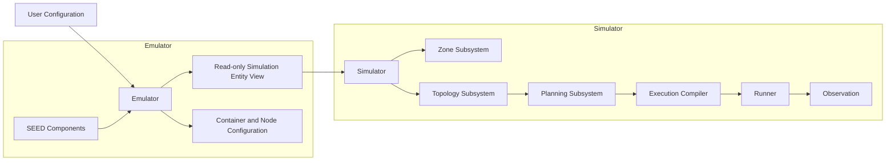
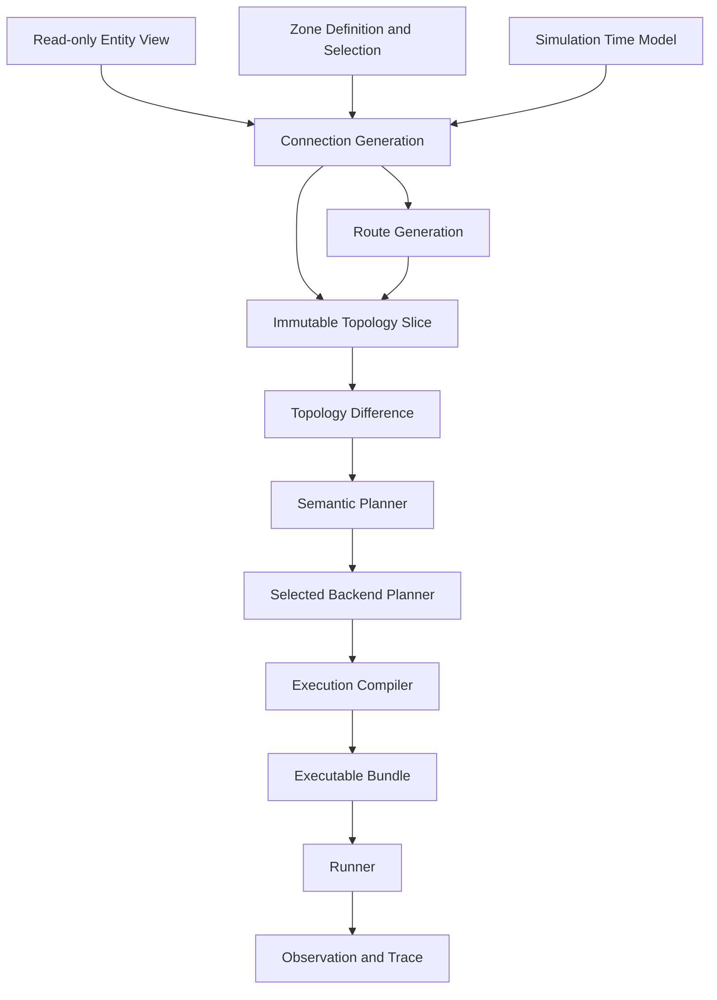
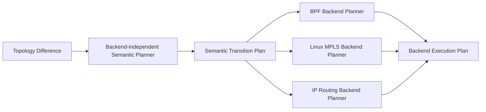
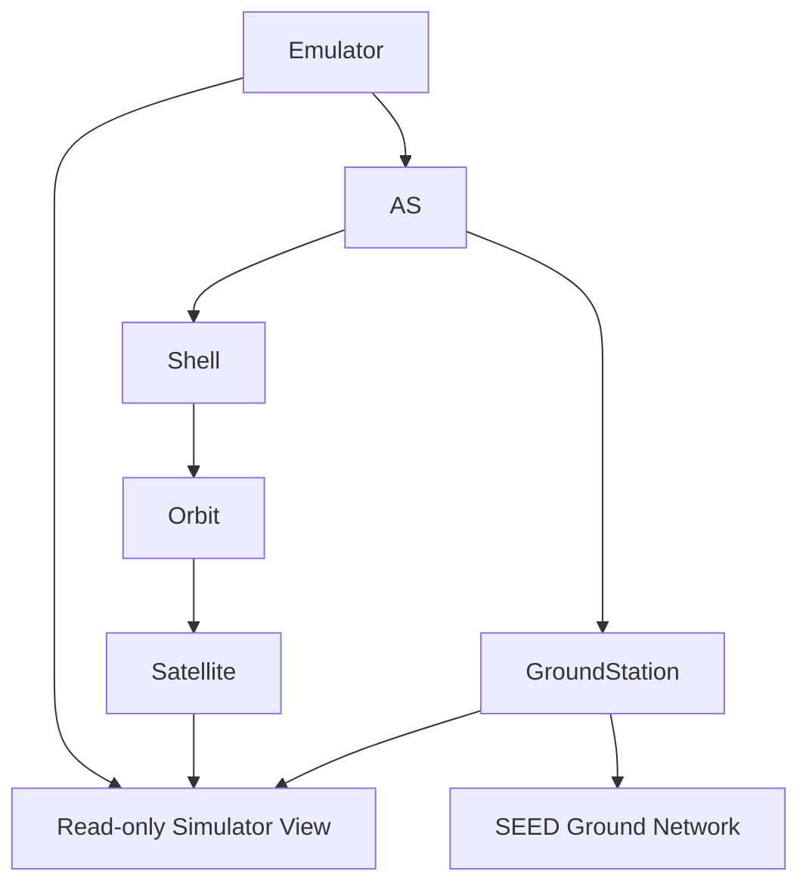

# Initial Architecture Diagrams

这些图只表达当前确认的模块关系和信息流，不代表最终类图或最终 API。

## 1. System boundary

```mermaid
flowchart LR
    User[User Configuration]

    subgraph Emulator
        Emu[Emulator]
        Seed[SEED Components]
        Catalog[Read-only Simulation Entity View]
        RuntimeNodes[Container and Node Configuration]
    end

    subgraph Simulator
        Simu[Simulator]
        Zone[Zone Subsystem]
        Topology[Topology Subsystem]
        Planner[Planning Subsystem]
        Compiler[Execution Compiler]
        Runner[Runner]
        Observer[Observation]
    end

    User --> Emu
    Seed --> Emu
    Emu --> RuntimeNodes
    Emu --> Catalog
    Catalog --> Simu
    Simu --> Zone
    Simu --> Topology
    Topology --> Planner
    Planner --> Compiler
    Compiler --> Runner
    Runner --> Observer
```

## 2. Simulator flow

```mermaid
flowchart TD
    Catalog[Read-only Entity View]
    Zone[Zone Definition and Selection]
    Time[Simulation Time Model]
    Connection[Connection Generation]
    Route[Route Generation]
    Slice[Immutable Topology Slice]
    Diff[Topology Difference]
    Semantic[Semantic Planner]
    Backend[Selected Backend Planner]
    Compiler[Execution Compiler]
    Bundle[Executable Bundle]
    Runner[Runner]
    Observation[Observation and Trace]

    Catalog --> Connection
    Zone --> Connection
    Time --> Connection
    Connection --> Route
    Connection --> Slice
    Route --> Slice
    Slice --> Diff
    Diff --> Semantic
    Semantic --> Backend
    Backend --> Compiler
    Compiler --> Bundle
    Bundle --> Runner
    Runner --> Observation
```

## 3. Planning layers

```mermaid
flowchart LR
    Difference[Topology Difference]
    SemanticPlanner[Backend-independent Semantic Planner]
    SemanticPlan[Semantic Transition Plan]

    Difference --> SemanticPlanner
    SemanticPlanner --> SemanticPlan

    SemanticPlan --> BPF[BPF Backend Planner]
    SemanticPlan --> MPLS[Linux MPLS Backend Planner]
    SemanticPlan --> IP[IP Routing Backend Planner]

    BPF --> ExecutionPlan[Backend Execution Plan]
    MPLS --> ExecutionPlan
    IP --> ExecutionPlan
```

## 4. Emulator static hierarchy concept

```mermaid
flowchart TD
    Emulator --> AS
    AS --> Shell
    Shell --> Orbit
    Orbit --> Satellite

    AS --> GroundStation
    GroundStation --> GroundNetwork[SEED Ground Network]

    Emulator --> ReadOnlyView[Read-only Simulator View]
    Satellite --> ReadOnlyView
    GroundStation --> ReadOnlyView
```
